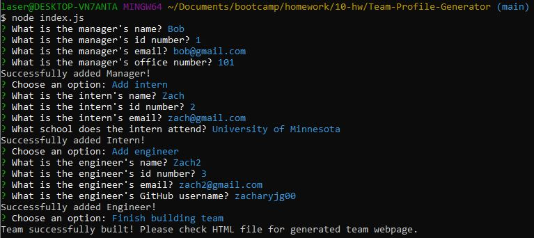
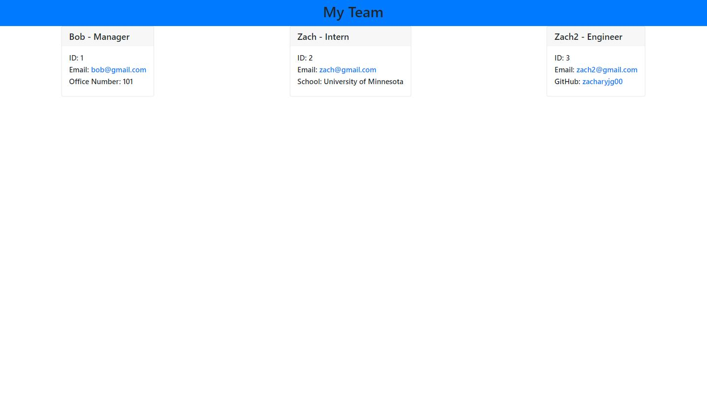
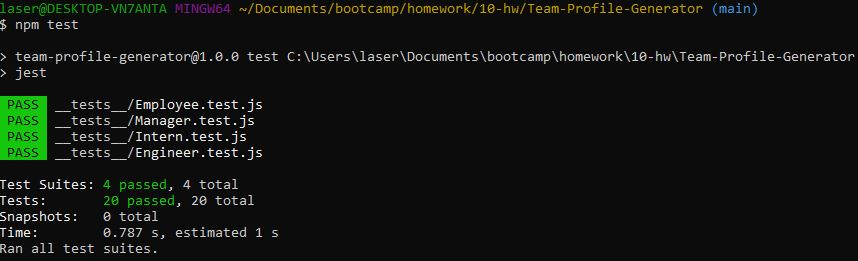
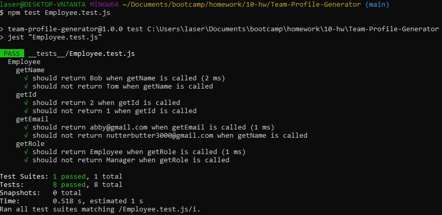

# Team-Profile-Generator

## Description
This is a Team Profile Generator. This is an app that is run using node.js where the user is prompted for information about their team and an html webpage is generated using the information that is given. The webpage contains cards that display the information about all members in the team. The user is first prompted for information about the manager and then has the option to either add an engineer, an intern, or complete their team. 

 

## Testing
There is test code associated with the four classes that are included in this app. These can be run from the command line using  `npm test`. To run individual tests simply run `npm test *NAME OF TEST FILE HERE*`. For example, to run the tests for the Employee class, run `npm test Employee.test.js`.

 

## Installation and Operation
In order to run this app, the user must first clone the repo locally and then navigate into the cloned repo. Once in the cloned repo, run `npm install`. After the packages are installed, then the app can be started using `node index.js`.

 

## Images

**Above is an image of the app being run from the command line with all prompts filled out and completed**

 

**Above is an image of the generated webpage from all of the answers given in the image above this one**

 

**Above is an image of all of the test suites being ran and passed**

 

**Above is an image of an individual test suite being run and passed**

 

## Video Link and Deployed Sample
Below is a link to a video that gives a demo of the app as well as a link to the deployed html generated in the video. Enjoy!

Video Link: https://drive.google.com/file/d/1nzYqxvdXvuVfvorGi5QbgQeilCjUhsnS/view?usp=sharing  
Webpage Link: https://zacharyjg00.github.io/Team-Profile-Generator/